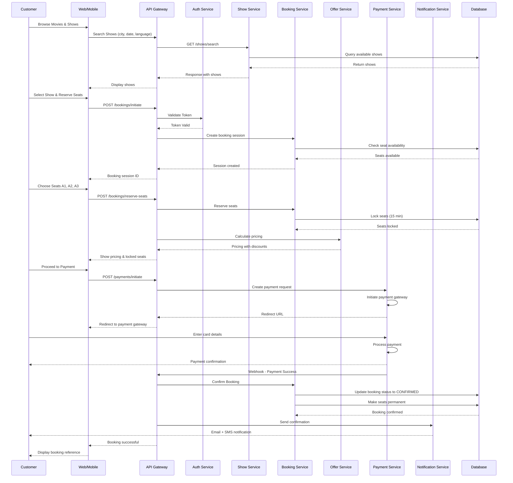

# System Architecture Diagram

```mermaid
graph TB
    subgraph "Client Layer"
        WEB[Web Portal<br/>React/Vue.js]
        MOBILE[Mobile App<br/>iOS/Android]
        ADMIN[Theatre Admin<br/>Dashboard]
    end

    subgraph "API Gateway"
        APIGW["API Gateway<br/>Kong/AWS ALB<br/>- Authentication<br/>- Rate Limiting<br/>- Request Routing<br/>- Load Balancing"]
    end

    subgraph "Microservices"
        AUTH["Auth Service<br/>Spring Boot<br/>- User Auth<br/>- JWT Management<br/>- RBAC"]
        
        THEATRE["Theatre Service<br/>Spring Boot<br/>- Partner Onboarding<br/>- Screen Management<br/>- KYC Verification"]
        
        SHOW["Show Service<br/>Spring Boot<br/>- Show CRUD<br/>- Content Management<br/>- Movie Scheduling"]
        
        BOOKING["Booking Service<br/>Spring Boot<br/>- Seat Reservation<br/>- Booking Management<br/>- Inventory Control"]
        
        PAYMENT["Payment Service<br/>Spring Boot<br/>- Payment Processing<br/>- Gateway Integration<br/>- Settlement"]
        
        OFFER["Offer Service<br/>Spring Boot<br/>- Dynamic Pricing<br/>- Promotions<br/>- Discounts"]
        
        NOTIFICATION["Notification Service<br/>Spring Boot<br/>- Email/SMS/Push<br/>- Preferences<br/>- Audit Logging"]
        
        SEARCH["Search Service<br/>Spring Boot<br/>- Movie Search<br/>- Filtering<br/>- Recommendations"]
        
        ANALYTICS["Analytics Service<br/>Spring Boot<br/>- Metrics<br/>- Revenue Reporting<br/>- KPI Dashboard"]
    end

    subgraph "Data Layer"
        POSTGRES["PostgreSQL<br/>- Master DB<br/>- Transactional Data<br/>- Read Replicas"]
        
        REDIS["Redis<br/>- Session Cache<br/>- Seat Locks<br/>- Rate Limiting"]
        
        ELASTIC["Elasticsearch<br/>- Full-Text Search<br/>- Movie Indexing<br/>- Analytics"]
    end

    subgraph "Message Queue"
        KAFKA["Kafka<br/>- Event Streaming<br/>- Service Communication<br/>- Event Log"]
    end

    subgraph "External Services"
        PAYMENT_GW["Payment Gateway<br/>Stripe/Razorpay/PayU"]
        EMAIL["Email Service<br/>SendGrid/SES"]
        SMS["SMS Service<br/>Twilio"]
        AUTH_PROVIDER["OAuth Provider<br/>Google/Facebook"]
    end

    subgraph "Infrastructure"
        K8S["Kubernetes Cluster<br/>- Service Orchestration<br/>- Auto-scaling<br/>- Multi-AZ"]
        
        MONITORING["Monitoring<br/>Prometheus/Grafana<br/>- Metrics<br/>- Alerts<br/>- Dashboards"]
        
        LOGGING["Logging<br/>ELK Stack<br/>- Log Aggregation<br/>- Analysis"]
        
        TRACING["Distributed Tracing<br/>Jaeger/Zipkin<br/>- Request Tracing<br/>- Performance"]
    end

    subgraph "CI/CD"
        GITHUB["GitHub<br/>- Source Code<br/>- Version Control"]
        
        ACTIONS["GitHub Actions<br/>- Build<br/>- Test<br/>- Deploy"]
        
        REGISTRY["Container Registry<br/>ECR/DockerHub<br/>- Image Storage"]
    end

    WEB --> APIGW
    MOBILE --> APIGW
    ADMIN --> APIGW

    APIGW --> AUTH
    APIGW --> THEATRE
    APIGW --> SHOW
    APIGW --> BOOKING
    APIGW --> PAYMENT
    APIGW --> OFFER
    APIGW --> NOTIFICATION
    APIGW --> SEARCH
    APIGW --> ANALYTICS

    AUTH --> POSTGRES
    THEATRE --> POSTGRES
    SHOW --> POSTGRES
    BOOKING --> POSTGRES
    PAYMENT --> POSTGRES
    NOTIFICATION --> POSTGRES

    AUTH --> REDIS
    BOOKING --> REDIS
    OFFER --> REDIS

    SEARCH --> ELASTIC
    ANALYTICS --> ELASTIC

    AUTH --> KAFKA
    THEATRE --> KAFKA
    SHOW --> KAFKA
    BOOKING --> KAFKA
    PAYMENT --> KAFKA
    NOTIFICATION --> KAFKA

    PAYMENT --> PAYMENT_GW
    NOTIFICATION --> EMAIL
    NOTIFICATION --> SMS
    AUTH --> AUTH_PROVIDER

    AUTH --> K8S
    THEATRE --> K8S
    SHOW --> K8S
    BOOKING --> K8S
    PAYMENT --> K8S
    OFFER --> K8S
    NOTIFICATION --> K8S
    SEARCH --> K8S
    ANALYTICS --> K8S

    K8S --> MONITORING
    K8S --> LOGGING
    K8S --> TRACING

    GITHUB --> ACTIONS
    ACTIONS --> REGISTRY
    REGISTRY --> K8S

    style WEB fill:#e1f5ff
    style MOBILE fill:#e1f5ff
    style ADMIN fill:#e1f5ff
    style APIGW fill:#fff3e0
    style AUTH fill:#f3e5f5
    style THEATRE fill:#f3e5f5
    style SHOW fill:#f3e5f5
    style BOOKING fill:#f3e5f5
    style PAYMENT fill:#f3e5f5
    style OFFER fill:#f3e5f5
    style NOTIFICATION fill:#f3e5f5
    style SEARCH fill:#f3e5f5
    style ANALYTICS fill:#f3e5f5
    style POSTGRES fill:#e8f5e9
    style REDIS fill:#e8f5e9
    style ELASTIC fill:#e8f5e9
    style KAFKA fill:#fce4ec
    style K8S fill:#f1f8e9
```

## High-Level Flow: Complete Booking Process

```mermaid
sequenceDiagram
    participant Customer
    participant Client as Web/Mobile
    participant GW as API Gateway
    participant Auth as Auth Service
    participant Show as Show Service
    participant Booking as Booking Service
    participant Offer as Offer Service
    participant Payment as Payment Service
    participant Notification as Notification Service
    participant DB as Database

    Customer->>Client: Browse Movies & Shows
    Client->>GW: Search Shows (city, date, language)
    GW->>Show: GET /shows/search
    Show->>DB: Query available shows
    DB-->>Show: Return shows
    Show-->>GW: Response with shows
    GW-->>Client: Display shows

    Customer->>Client: Select Show & Reserve Seats
    Client->>GW: POST /bookings/initiate
    GW->>Auth: Validate Token
    Auth-->>GW: Token Valid
    GW->>Booking: Create booking session
    Booking->>DB: Check seat availability
    DB-->>Booking: Seats available
    Booking-->>GW: Session created
    GW-->>Client: Booking session ID

    Customer->>Client: Choose Seats A1, A2, A3
    Client->>GW: POST /bookings/reserve-seats
    GW->>Booking: Reserve seats
    Booking->>DB: Lock seats (15 min)
    DB-->>Booking: Seats locked
    GW->>Offer: Calculate pricing
    Offer-->>GW: Pricing with discounts
    GW-->>Client: Show pricing & locked seats

    Customer->>Client: Proceed to Payment
    Client->>GW: POST /payments/initiate
    GW->>Payment: Create payment request
    Payment->>Payment: Initiate payment gateway
    Payment-->>GW: Redirect URL
    GW-->>Client: Redirect to payment gateway

    Customer->>Payment: Enter card details
    Payment->>Payment: Process payment
    Payment-->>Customer: Payment confirmation

    Payment->>GW: Webhook - Payment Success
    GW->>Booking: Confirm Booking
    Booking->>DB: Update booking status to CONFIRMED
    Booking->>DB: Make seats permanent
    DB-->>Booking: Booking confirmed
    GW->>Notification: Send confirmation
    Notification-->>Customer: Email + SMS notification

    GW-->>Client: Booking successful
    Client-->>Customer: Display booking reference
```

---

**Document Version**: 1.0  
**Last Updated**: April 2026
